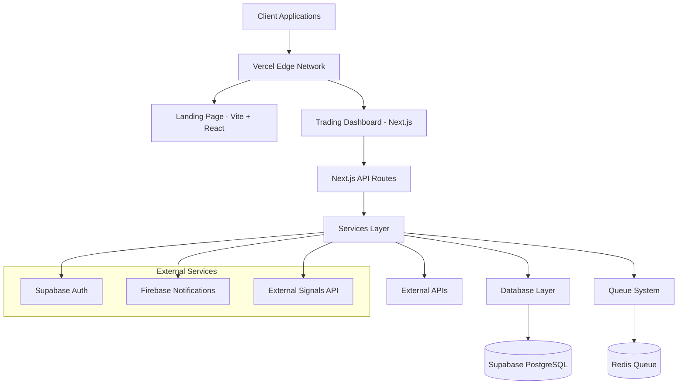

# Tradeia Platform Architecture

## Overview

Tradeia is a comprehensive algorithmic trading platform built as a monorepo with two main applications: a marketing landing page and a full-featured trading dashboard. The platform provides tools for strategy development, backtesting, portfolio management, and real-time trading signals.

## Table of Contents

- [System Architecture](#system-architecture)
- [Application Structure](#application-structure)
- [Technology Stack](#technology-stack)
- [Core Components](#core-components)
- [Data Architecture](#data-architecture)
- [Security Architecture](#security-architecture)
- [Deployment Architecture](#deployment-architecture)
- [Performance & Scalability](#performance--scalability)
- [Development Workflow](#development-workflow)

## System Architecture



## Application Structure

### Monorepo Architecture

```
tradeia/
├── apps/
│   ├── landing/          # Marketing website (Vite + React)
│   └── tradeia/          # Main trading platform (Next.js)
├── .planr/               # Project planning system
│   ├── stories/          # User stories and requirements
│   ├── roadmap.json      # Project roadmap
│   ├── prd.md           # Product requirements
│   └── assetlist.json   # Project assets
├── package.json          # Root build orchestration
└── vercel.json           # Deployment configuration
```

### Landing Page Application

**Purpose**: Marketing and user acquisition website

**Technology Stack**:
- **Framework**: Vite + React 18
- **Language**: TypeScript
- **Styling**: Tailwind CSS
- **Routing**: React Router DOM
- **Build**: Vite (fast HMR, optimized production builds)

**Key Features**:
- Responsive marketing website
- Multi-language support
- SEO optimization
- Fast loading performance
- Strategy documentation

### Trading Dashboard Application

**Purpose**: Full-featured algorithmic trading platform

**Technology Stack**:
- **Framework**: Next.js 15.3.4 (App Router)
- **Language**: TypeScript 5.4.3
- **Styling**: Tailwind CSS 3.4.1
- **UI Components**: Headless UI 2.2.4
- **Database**: Supabase (PostgreSQL)
- **Authentication**: Supabase Auth
- **Real-time**: Supabase Realtime
- **Notifications**: Firebase Cloud Messaging
- **Charts**: Chart.js 4.4.2
- **Testing**: Jest, React Testing Library, Cypress
- **Deployment**: Vercel

## Technology Stack

### Frontend Layer
- **React 19.1.1**: Modern React with concurrent features
- **Next.js 15.5.0**: Full-stack React framework
- **TypeScript 5.6.3**: Type-safe JavaScript
- **Tailwind CSS 3.4.17**: Utility-first CSS framework
- **Headless UI 2.0.0**: Accessible UI components

### Backend Layer
- **Next.js API Routes**: Serverless API endpoints
- **Supabase 2.56.0**: PostgreSQL database with real-time features
- **Redis 5.8.0**: Caching and message queues
- **Node.js 18+**: JavaScript runtime

### Security & Validation
- **Joi 18.0.1**: Schema validation
- **Helmet 8.1.0**: Security headers
- **bcryptjs 3.0.2**: Password hashing
- **express-rate-limit 8.1.0**: Rate limiting

### Development Tools
- **Jest 30.1.2**: Unit testing framework
- **Cypress 13.10.0**: E2E testing
- **ESLint 9.5.0**: Code linting
- **TypeScript Compiler**: Type checking
- **Husky 9.1.6**: Git hooks

## Core Components

### Presentation Layer

```
apps/tradeia/src/
├── app/                  # Next.js App Router
│   ├── layout.tsx       # Root layout
│   ├── page.tsx         # Home page
│   ├── dashboard/       # Protected dashboard routes
│   ├── login/           # Authentication pages
│   └── api/             # API routes
├── components/          # Reusable UI components
│   ├── ui/             # Base UI components
│   ├── auth/           # Authentication components
│   └── dashboard/      # Dashboard-specific components
└── contexts/           # React contexts for state management
```

### Application Layer

```
src/lib/
├── services/           # Business logic services
│   ├── SignalsService.ts      # Trading signals management
│   └── NotificationService.ts # Notification handling
├── middleware/         # Security & request middleware
├── utils/              # Utility functions
│   ├── validation.ts   # Input validation (Joi schemas)
│   ├── error-handler.ts # Error handling utilities
│   ├── cache.ts        # Caching mechanisms
│   └── api-versioning.ts # API versioning logic
├── database/           # Database connection & helpers
├── queue/              # Message queue system
├── workers/            # Background job processors
└── signals/            # Signal processing utilities
```

### Data Layer

#### Primary Database: Supabase PostgreSQL

**Schema Overview**:
- **users**: User accounts and profiles
- **strategies**: Trading strategies configuration
- **user_api_keys**: API key management
- **notifications**: User notifications and preferences
- **jwt_claims**: Authentication claims

**Migration Files**:
- `20240721_add_onboarding_complete.sql`
- `20240822_add_jwt_claims.sql`
- `20240911_create_strategies_tables.sql`
- `20250921_create_notifications_tables.sql`
- `20240729000001_create_user_api_keys.sql`

#### Caching & Queue System
- **Redis**: Rate limiting, session storage, job queues
- **In-memory Cache**: Application-level caching for frequently accessed data

## Security Architecture

### Authentication & Authorization
- **Supabase Auth**: JWT-based authentication with secure session management
- **Session Management**: Secure cookie handling with HttpOnly and SameSite
- **Role-based Access Control**: Granular permissions for different user types
- **API Key Management**: Secure external API integrations

### API Security
- **Rate Limiting**: Distributed rate limiting (100 req/min per IP) with Redis
- **Input Validation**: Comprehensive Joi schema validation for all inputs
- **Request Sanitization**: XSS and SQL injection prevention
- **Security Headers**: OWASP-compliant headers (CSP, X-Frame-Options, etc.)
- **CORS Policies**: Configured cross-origin request handling

### Data Protection
- **Encryption**: Data encrypted at rest and in transit
- **Secure Cookies**: HttpOnly, Secure, and SameSite cookie attributes
- **Audit Logging**: Comprehensive request/response logging for compliance

### Security Monitoring
- **Real-time Monitoring**: Rate limit tracking and security event logging
- **Automated Audits**: Regular security scanning and dependency checks
- **Incident Response**: Structured security incident handling procedures
- **Compliance**: Industry standard security practices

## Deployment Architecture

### Vercel Deployment

**Configuration** (`vercel.json`):
```json
{
  "builds": [
    {
      "src": "apps/landing/package.json",
      "use": "@vercel/static-build"
    },
    {
      "src": "apps/tradeia/package.json",
      "use": "@vercel/next"
    }
  ],
  "routes": [
    { "src": "/", "dest": "/apps/landing" },
    { "src": "/app/(.*)", "dest": "/apps/tradeia/$1" },
    { "src": "/(.*)", "dest": "/apps/tradeia/$1" }
  ]
}
```

**Routing Strategy**:
- `/` → Landing page
- `/app/*` → Trading dashboard
- `/landing/*` → Landing page (alternative)
- All other routes → Trading dashboard

### Containerization Support

**Docker Configuration**:
- Multi-stage builds for optimized images
- Docker Compose for local development
- Production-ready containerization
- Environment-based configuration

## Performance & Scalability

### Performance Optimizations
- **Next.js Optimization**: Automatic code splitting, image optimization
- **Caching Strategy**: Multi-layer caching (browser, CDN, server, database)
- **Database Pooling**: Connection pooling for database efficiency
- **CDN**: Vercel Edge Network for global distribution

### Scalability Features
- **Horizontal Scaling**: Stateless API design
- **Database Sharding**: Supabase managed scaling
- **Queue-based Processing**: Asynchronous job processing
- **Rate Limiting**: Protection against abuse

### Monitoring & Observability
- **Application Monitoring**: Error tracking and performance monitoring
- **API Monitoring**: Request/response logging and metrics
- **Business Intelligence**: Usage patterns and feature adoption tracking
- **System Health**: Database performance and API response times

## Development Workflow

### Testing Strategy
- **Unit Tests**: Jest for component and utility testing
- **Integration Tests**: API route testing
- **E2E Tests**: Cypress for full user workflows
- **Component Tests**: React Testing Library

### Quality Assurance
- **Linting**: ESLint configuration
- **Type Checking**: TypeScript strict mode
- **Code Coverage**: Jest coverage reporting (80% target)
- **API Compliance**: Custom validation scripts

### CI/CD Pipeline
- **Build Validation**: Automated testing on commits
- **Deployment**: Vercel automatic deployments
- **Environment Management**: Separate staging/production configs

## External Integrations

### Third-party Services
- **Supabase**: Database, Auth, Real-time features
- **Firebase**: Push notifications and cloud messaging
- **Redis**: Caching and message queues
- **Vercel**: Hosting and CDN infrastructure

### API Integrations
- **Signals API**: External trading signals provider
- **Market Data**: Real-time market data feeds
- **Broker APIs**: Trading execution platforms

## Security Improvement Roadmap

The platform includes comprehensive security enhancements tracked as user stories:

### Immediate Actions (SEC-001 to SEC-004)
- **SEC-001**: Standardize Security Middleware Application
- **SEC-002**: Implement Comprehensive Joi Validation
- **SEC-003**: Production-Grade Rate Limiting with Redis
- **SEC-004**: Request Size Limits and Payload Validation

### Enhancement Actions (SEC-005 to SEC-007)
- **SEC-005**: Enhanced Password Security Policies
- **SEC-006**: API Versioning Security Implementation
- **SEC-007**: Comprehensive Request Logging and Audit

### Monitoring & Compliance (SEC-008 to SEC-010)
- **SEC-008**: Regular Security Audits and Scanning
- **SEC-009**: Security Monitoring and Alerting System
- **SEC-010**: Rate Limit Monitoring and Analytics

## Conclusion

Tradeia represents a modern, scalable algorithmic trading platform built with cutting-edge web technologies. The architecture emphasizes security, performance, and maintainability while providing a seamless user experience across marketing and trading functionalities. The monorepo structure, combined with Vercel's deployment capabilities, enables efficient development and deployment workflows.

The platform's security-first approach, comprehensive testing strategy, and modular architecture ensure it can scale to meet enterprise requirements while maintaining high performance and reliability standards.