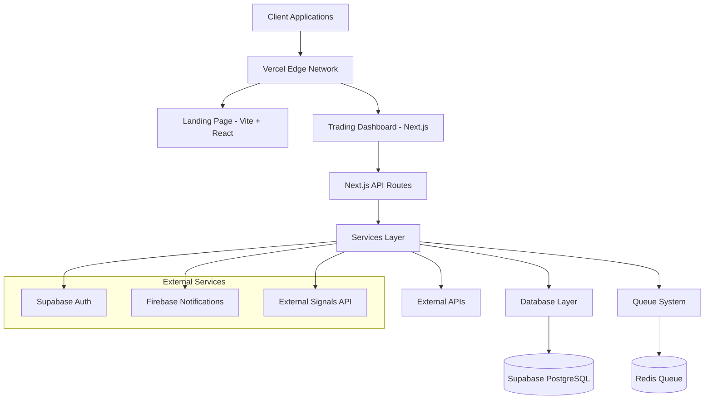

# Tradeia

Tradeia is a comprehensive algorithmic trading platform built as a monorepo with two main applications: a marketing landing page for user acquisition and a full-featured trading dashboard for strategy development, backtesting, portfolio management, and real-time trading signals.

## 📱 Applications

### 🏠 Landing Page (`apps/landing`)
A modern, responsive marketing website built with React, TypeScript, and Tailwind CSS. This serves as the entry point for users, providing information about the platform, features, pricing, and documentation.

**Tech Stack:**
- **Framework**: Vite + React 18
- **Language**: TypeScript
- **Styling**: Tailwind CSS
- **Icons**: Heroicons, Lucide React
- **Routing**: React Router DOM

**Features:**
- Responsive design optimized for all devices
- Multi-language support
- SEO optimized
- Fast loading with Vite build system

### 📊 Trading Dashboard (`apps/tradeia`)
A powerful web application for algorithmic trading, built with Next.js 15 and modern web technologies. Provides comprehensive tools for strategy development, backtesting, portfolio management, and real-time trading signals.

**Tech Stack:**
- **Framework**: Next.js 15.3.4
- **Language**: TypeScript 5.4.3
- **Styling**: Tailwind CSS 3.4.1
- **UI Components**: Headless UI 2.2.4
- **Database**: Supabase (PostgreSQL)
- **Authentication**: Supabase Auth
- **Real-time**: Supabase Realtime
- **Notifications**: Firebase Cloud Messaging
- **Charts**: Chart.js 4.4.2
- **Testing**: Jest, React Testing Library, Cypress
- **Deployment**: Vercel

**Features:**
- User authentication and authorization
- Strategy creation and management
- Backtesting engine with historical data
- Portfolio tracking and analytics
- Real-time trading signals
- API key management for external integrations
- Dashboard with comprehensive stats and charts
- Mobile-responsive design

## 🏗️ Architecture Overview

Tradeia follows a modern monorepo architecture with clear separation of concerns across multiple layers.

### System Architecture



### Core Architecture Layers

#### 🎯 **Presentation Layer**
- **Next.js App Router**: Modern React framework with SSR/SSG
- **Component Architecture**: Reusable UI components with TypeScript
- **Responsive Design**: Mobile-first approach with Tailwind CSS

#### 🏢 **Application Layer**
- **Services**: Business logic encapsulation (SignalsService, NotificationService)
- **Middleware**: Security, validation, and request processing
- **Utilities**: Validation, error handling, caching, and API versioning

#### 🗄️ **Data Layer**
- **Primary Database**: Supabase PostgreSQL with connection pooling
- **Caching**: Redis for session storage and rate limiting
- **Queue System**: Asynchronous job processing with Redis

#### 🔐 **Security Layer**
- **Authentication**: Supabase Auth with JWT tokens
- **Authorization**: Role-based access control
- **Input Validation**: Joi schema validation
- **Rate Limiting**: Distributed rate limiting with Redis
- **Security Headers**: OWASP-compliant headers and CORS policies

## 🚀 Getting Started

### Prerequisites
- Node.js 18+
- npm or pnpm

### Installation

1. **Clone the repository**
   ```bash
   git clone <repository-url>
   cd tradeia
   ```

2. **Install dependencies**
   ```bash
   npm install
   ```

3. **Set up environment variables**
   - Copy `apps/tradeia/env.example` to `apps/tradeia/.env.local`
   - Configure your Supabase and Firebase credentials

4. **Run the applications**
   ```bash
   # Landing page (port 5173)
   cd apps/landing
   npm run dev

   # Trading dashboard (port 3000) - in another terminal
   cd apps/tradeia
   npm run dev
   ```

### Docker Setup

The trading dashboard supports Docker deployment:

```bash
cd apps/tradeia
npm run docker:compose  # Builds and runs with Docker Compose
```

## 📁 Project Structure

```
tradeia/
├── apps/
│   ├── landing/          # Marketing website (Vite + React)
│   │   ├── src/
│   │   ├── public/
│   │   └── docs/         # Strategy documentation
│   └── tradeia/          # Main trading platform (Next.js)
│       ├── src/
│       │   ├── app/      # Next.js App Router pages
│       │   ├── components/ # Reusable UI components
│       │   ├── lib/      # Business logic and utilities
│       │   │   ├── services/     # Business services
│       │   │   ├── middleware/   # Security middleware
│       │   │   ├── utils/        # Validation, caching, etc.
│       │   │   ├── database/     # Database helpers
│       │   │   ├── queue/        # Message queue system
│       │   │   └── signals/      # Signal processing
│       │   ├── types/    # TypeScript type definitions
│       │   └── contexts/ # React contexts
│       ├── supabase/     # Database migrations
│       ├── cypress/      # E2E tests
│       └── __tests__/    # Unit and integration tests
├── .planr/               # Project planning system
│   ├── stories/          # User stories and requirements
│   ├── roadmap.json      # Project roadmap
│   ├── prd.md           # Product requirements
│   └── assetlist.json   # Project assets
├── package.json          # Root build scripts
└── vercel.json           # Deployment configuration
```

## 🔐 Security Features

Tradeia implements enterprise-grade security measures:

### Authentication & Authorization
- **Supabase Auth**: JWT-based authentication with secure session management
- **Role-based Access Control**: Granular permissions for different user types
- **API Key Management**: Secure external API integrations

### API Security
- **Rate Limiting**: Distributed rate limiting (100 req/min per IP) with Redis
- **Input Validation**: Comprehensive Joi schema validation for all inputs
- **Request Sanitization**: XSS and SQL injection prevention
- **Security Headers**: OWASP-compliant headers (CSP, X-Frame-Options, etc.)
- **CORS Policies**: Configured cross-origin request handling

### Data Protection
- **Encryption**: Data encrypted at rest and in transit
- **Secure Cookies**: HttpOnly, Secure, and SameSite cookie attributes
- **Audit Logging**: Comprehensive request/response logging for compliance

### Monitoring & Compliance
- **Security Monitoring**: Real-time threat detection and alerting
- **Regular Audits**: Automated security scanning and dependency checks
- **Incident Response**: Structured incident handling procedures

## 🔧 Development

### Available Scripts

**Root level:**
- `npm run build` - Build both applications
- `npm run build:next` - Build trading dashboard
- `npm run build:vite` - Build landing page

**Landing page (`apps/landing`):**
- `npm run dev` - Start development server
- `npm run build` - Build for production
- `npm run preview` - Preview production build
- `npm run lint` - Run ESLint

**Trading dashboard (`apps/tradeia`):**
- `npm run dev` - Start development server
- `npm run build` - Build for production
- `npm run start` - Start production server
- `npm run lint` - Run ESLint
- `npm test` - Run unit tests
- `npm run test:e2e` - Run E2E tests
- `npm run docker:compose` - Run with Docker

## 🚀 Deployment

The project is configured for deployment on Vercel with the following routing:

- `/` - Landing page
- `/app/*` - Trading dashboard
- `/landing/*` - Landing page (alternative route)

## 📋 Project Planning

Tradeia uses a structured planning system located in the `.planr/` directory:

### Planning Structure
```
.planr/
├── stories/              # User stories and feature specifications
│   ├── SEC-001.md       # Standardize Security Middleware
│   ├── SEC-002.md       # Implement Joi Validation
│   ├── SEC-003.md       # Production-Grade Rate Limiting
│   └── ...              # Additional security and feature stories
├── roadmap.json          # Project roadmap with task tracking
├── prd.md               # Product requirements document
└── assetlist.json       # Project assets and resources
```

### Security Improvement Stories
The platform includes comprehensive security enhancements tracked as user stories:
- **SEC-001**: Standardize Security Middleware Application
- **SEC-002**: Implement Comprehensive Joi Validation
- **SEC-003**: Production-Grade Rate Limiting with Redis
- **SEC-004**: Request Size Limits and Payload Validation
- **SEC-005**: Enhanced Password Security Policies
- **SEC-006**: API Versioning Security Implementation
- **SEC-007**: Comprehensive Request Logging and Audit
- **SEC-008**: Regular Security Audits and Scanning
- **SEC-009**: Security Monitoring and Alerting System
- **SEC-010**: Rate Limit Monitoring and Analytics

## 📚 Documentation

- [Trading Strategies](./apps/landing/docs/) - Strategy documentation and guides
- [API Reference](./apps/tradeia/docs/) - API documentation and integrations
- [Development Guide](./apps/tradeia/README.md) - Detailed setup for the trading platform
- [Security Stories](./.planr/stories/) - Security improvement specifications
- [Architecture Overview](./README.md#architecture-overview) - System architecture documentation

## 🤝 Contributing

1. Fork the repository
2. Create a feature branch
3. Make your changes
4. Add tests if applicable
5. Submit a pull request

## 👥 Hiring & Contributions

**This repository is public for hiring purposes only.** We welcome talented developers to review our codebase during the recruitment process.

### For Candidates
- **NDA Required**: All candidates must sign a Non-Disclosure Agreement before accessing the repository
- **Code Review Only**: This code is for evaluation purposes only
- **No Commercial Use**: Candidates may not use, copy, or distribute this code for any commercial purposes
- **Contact**: Reach out to our HR team for NDA and access procedures

### For Contributors
We currently do not accept external contributions to maintain code quality and protect our proprietary algorithms. However, we value community feedback and may consider strategic partnerships.

## 📄 License

**Proprietary License - All Rights Reserved**

This software and all associated intellectual property are proprietary and confidential. Unauthorized copying, modification, distribution, or use of this software is strictly prohibited.

- Commercial use only
- No redistribution or public sharing of source code
- All rights reserved by the copyright holder

For licensing inquiries or partnership opportunities, please contact the development team.