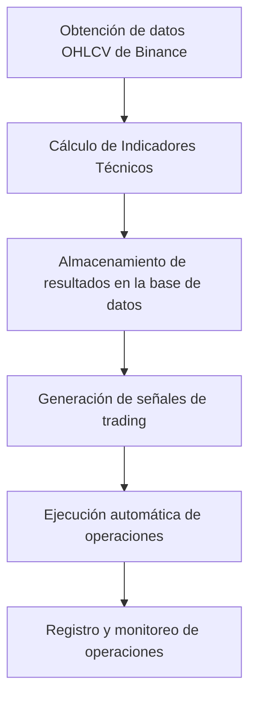
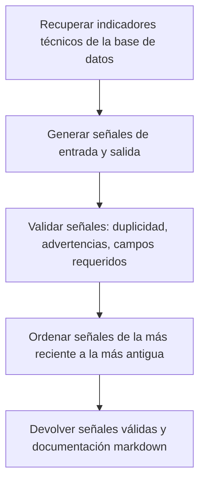
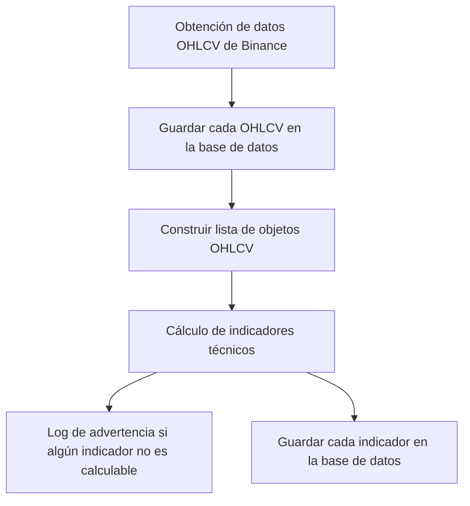

# Sistema de Trading Cuantitativo para Criptomonedas

Sistema automatizado de trading cuantitativo para criptomonedas que genera señales de entrada basadas en indicadores técnicos. **Enfoque principal: Timeframe 4H para señales de alta calidad.**

## 📚 **Documentación**

Para información detallada sobre la estrategia y uso del sistema, consulta la documentación completa:

- **[📊 Resumen Ejecutivo](docs/RESUMEN_EJECUTIVO.md)** - Vista rápida del sistema
- **[📋 Estrategia Actual](docs/ESTRATEGIA_ACTUAL.md)** - Documentación técnica completa
- **[🎯 Patrón Strategy](docs/PATRON_STRATEGY.md)** - Sistema de estrategias configurables
- **[📚 Índice de Documentación](docs/README.md)** - Organización de toda la documentación

## 🎯 **Características Principales**

- **Timeframe principal**: 4H (cada 4 horas)
- **Indicadores**: EMA55, RSI, ADX, DMI+/-, SQZMOM, ATR
- **Patrón Strategy**: 3 estrategias configurables (Conservadora, Moderada, Agresiva)
- **Criterios estrictos**: 4 de 5 condiciones requeridas (Moderada)
- **Filtros de calidad**: 12h mínimo entre señales, máximo 1 por par
- **Pares soportados**: BTC/USDT, LINK/USDT
- **Eficiencia**: 97.9% menos llamadas a la API

## Estructura del Proyecto

- `.planr/` - Directorio principal con artefactos de planificación
  - `stories/` - Historias de usuario y requisitos
  - `prd.md` - Documento de Requisitos del Producto

## Funcionalidades Principales

- Registro y autenticación de usuarios con 2FA
- Verificación KYC
- Conexión segura con Binance mediante claves API
- Configuración personalizada de trading y estrategia
- Ejecución automática de operaciones según señales generadas
- Visualización de operaciones activas, historial y métricas
- Notificaciones por email, SMS o in-app
- Gestión de riesgos y manejo de volatilidad
- Soporte y gestión de cuentas para usuarios y administradores

## Estrategia Técnica y Funcionamiento del Servicio

### 1. Flujo General del Servicio



### 2. Indicadores Técnicos Utilizados
- **EMA55**: Media móvil exponencial de 55 periodos sobre el cierre.
- **RSI (14)**: Índice de fuerza relativa para detectar sobrecompra/sobreventa.
- **DMI/ADX (14)**: Dirección y fuerza de la tendencia.
- **SQZMOMENT (Squeeze Momentum)**: Detecta periodos de baja volatilidad y posibles rupturas.

### 3. Funcionamiento Paso a Paso

1. **Obtención de datos**: El sistema obtiene datos OHLCV (Open, High, Low, Close, Volume) en tiempo real desde Binance para los pares configurados.
2. **Cálculo de indicadores**: Cada vez que se reciben nuevos datos, se calculan los indicadores técnicos usando TA-Lib y numpy:
   - EMA55, RSI y DMI/ADX con TA-Lib.
   - SQZMOMENT con una combinación de Bollinger Bands, Keltner Channels y momentum.
3. **Almacenamiento**: Los resultados de los indicadores se guardan en la base de datos junto con los datos OHLCV, permitiendo consultas históricas y optimización por caché.
4. **Generación de señales**: (Próxima historia) El sistema analizará los valores de los indicadores para generar señales de compra/venta según reglas configurables.
5. **Ejecución de operaciones**: Cuando se genera una señal, el sistema ejecuta automáticamente la orden en Binance usando las claves API del usuario.
6. **Monitoreo y registro**: Todas las operaciones y señales quedan registradas para análisis, métricas y auditoría.

### 4. Detalles Técnicos de la Estrategia

- Los cálculos de indicadores se actualizan en tiempo real y están optimizados para evitar recálculos innecesarios (caché).
- El sistema es extensible: se pueden agregar nuevos indicadores o modificar los parámetros fácilmente.
- El manejo de errores y validación de datos asegura la robustez del servicio.
- La arquitectura desacopla la obtención de datos, el cálculo de indicadores y la lógica de señales para facilitar el mantenimiento y la escalabilidad.

---

### Escenarios de Generación de Señales: Entrada, Objetivo y Stop-Loss

La lógica avanzada para la generación de señales de trading, incluyendo los criterios de entrada, cálculo de objetivos (TP1, TP2) y stop-loss, está documentada en detalle en:

[docs/escenarios_senales.md](docs/escenarios_senales.md)

En ese archivo encontrarás:
- Explicación de los escenarios principales (tendencia alcista, bajista, ruptura de rango, reversión por patrón gráfico).
- Fórmulas y ejemplos para calcular los valores clave de cada señal.
- Recomendaciones de gestión de riesgo y ajuste dinámico de stops.

---

### 5. Ejemplo de Flujo de Datos

1. Se recibe un nuevo dato OHLCV de Binance para BTC/USDT (por ejemplo, cada minuto).
2. Se calculan los valores de EMA55, RSI, DMI/ADX y SQZMOMENT para ese punto temporal.
3. Se almacenan los resultados en la base de datos.
4. (En la siguiente etapa) Se evalúan reglas de trading y, si corresponde, se ejecuta una orden.

---

## Flujo de Generación de Señales de Trading

### Descripción General

El sistema genera señales de trading (entrada y salida) a partir de los indicadores técnicos calculados para cada vela OHLCV. El flujo asegura que:
- Las señales se ordenan de la más reciente a la más antigua.
- Solo se consideran válidas aquellas señales que tienen definidos los campos de **entrada**, **objetivo** y **stop-loss**.

### Diagrama de Flujo



### Criterios de Validez y Calidad de una Señal

Una señal es considerada **válida** si cumple:
- Tiene definidos los campos:
  - **Entrada**: Precio de entrada sugerido (usualmente EMA55).
  - **Objetivo**: Precio objetivo calculado usando ATR (2-3x ATR).
  - **Stop-Loss**: Precio de stop calculado usando ATR (1x ATR).
- No es duplicada para el mismo símbolo, timeframe y timestamp.
- Las advertencias (como ADX bajo) no invalidan la señal, pero se documentan.

#### Filtros de Calidad Adicionales:
- **RSI**: Zonas de sobreventa/sobrecompra (RSI < 35 o RSI > 65) o RSI < 40/60 con DMI confirmado
- **ADX**: Mínimo 20 para tendencia moderada a fuerte
- **SQZMOM**: Momentum significativo (|SQZMOM| > 5) o DMI fuerte cuando SQZMOM = 0
- **DMI**: Diferencia mínima de 3 entre DMI+ y DMI-
- **ATR**: Volatilidad mínima de 50
- **Ratio riesgo/beneficio**: Mínimo 1.0:1
- **Ventana de tiempo**: Mínimo 2 horas entre señales del mismo par
- **Límite por par**: Máximo 3 señales activas por símbolo/timeframe

### Ejemplo de Respuesta de la API

```json
{
  "signals": [
    {
      "Activo": "BTC/USDT",
      "Entrada": 60000.0,
      "Objetivo": 63000.0,
      "Stop-Loss": 58800.0,
      "Riesgo": "1.5%",
      "Estado": "Activa",
      "Tipo": "BUY",
      "timeframe": "1h",
      "timestamp": "2024-07-10T12:00:00",
      "signal_type": "entry",
      "reason": "RSI < 40, ADX > 15, SQZMOM > 0",
      "ema55": 60000.0,
      "rsi": 28.0,
      "dmi": 20.5,
      "dmi_plus": 25.0,
      "adx": 27.0,
      "sqzmom": 150.0,
      "atr": 500.0
    }
  ],
  "markdowns": [
    "### Señal VÁLIDA\n- **Tipo:** entry\n- **Símbolo:** BTC/USDT\n- **Timeframe:** 1h\n- **Timestamp:** 2024-07-10 12:00:00\n- **Razón:** RSI < 40, ADX > 15, SQZMOM > 0\n- **EMA55:** 60000.0\n- **RSI:** 28.0\n- **DMI:** 20.5\n- **ADX:** 27.0\n- **SQZMOM:** 150.0\n- **Validaciones:** Todas las validaciones superadas"
  ]
}
```

### Notas de Implementación
- Las señales se ordenan por timestamp descendente antes de ser devueltas.
- Si una señal no tiene definidos los campos de entrada, objetivo o stop-loss, se descarta como inválida.
- El endpoint `/signals/generate` implementa este flujo y devuelve tanto las señales válidas como su documentación en markdown.

---

## Migration

# Opción 1: Script automatizado (recomendado)
python scripts/run_migration.py

# Opción 2: Alembic
alembic upgrade head

# Opción 3: SQL manual
psql -d your_database -f migrations/001_create_signals_table.sql

## Identificación de Escenarios de Mercado

El sistema identifica automáticamente el **escenario de mercado** para cada punto temporal, clasificando cada situación en una de las siguientes categorías:
- **Tendencia fuerte alcista**
- **Tendencia fuerte bajista**
- **Tendencia fuerte** (sin dirección clara entre DMI+ y DMI-)
- **Consolidación**
- **Reversión**
- **Patrón gráfico** (placeholder, pendiente de lógica avanzada)
- **Desconocido** (si no se cumplen las condiciones anteriores)

### ¿Cómo se determina el escenario?

La lógica está basada en los indicadores y reglas del archivo `docs/strategy.md`:

- **Tendencia fuerte**: Si el valor de ADX es mayor a 25. Si DMI+ > DMI-, se considera alcista; si DMI- > DMI+, bajista.
- **Consolidación**: Si ADX < 20 y el valor absoluto de SQZMOM es cercano a cero (baja volatilidad y sin momentum claro).
- **Reversión**: Si SQZMOM muestra momentum (positivo o negativo) y ADX está entre 15 y 25 (zona de transición o cambio de tendencia).
- **Patrón gráfico**: (Reservado para futura lógica de detección de patrones gráficos complejos).
- **Desconocido**: Si no se cumplen las condiciones anteriores.

Esta identificación se realiza automáticamente en el backend cada vez que se calculan los indicadores técnicos para una vela OHLCV. El resultado se almacena en el campo `market_scenario` de cada señal y se expone en la API.

### Ejemplo de respuesta de la API con escenario de mercado

```json
{
  "signals": [
    {
      "Activo": "BTC/USDT",
      "Entrada": 60000.0,
      "Objetivo": 63000.0,
      "Stop-Loss": 58800.0,
      "Riesgo": "1.5%",
      "Estado": "Activa",
      "timeframe": "1h",
      "timestamp": "2024-07-10T12:00:00",
      "signal_type": "entry",
      "reason": "RSI < 40, ADX > 15, SQZMOM > 0",
      "ema55": 60000.0,
      "rsi": 28.0,
      "dmi": 20.5,
      "dmi_plus": 25.0,
      "adx": 27.0,
      "sqzmom": 150.0,
      "atr": 500.0,
      "market_scenario": "tendencia fuerte alcista"
    }
  ]
}
```

El campo `market_scenario` permite a la lógica de señales y a los usuarios saber en qué contexto de mercado se encuentra cada señal, facilitando la toma de decisiones y la aplicación de reglas específicas de entrada, objetivo y stop-loss.

---

## Diseño del Flujo de Datos e Implementación de Indicadores Técnicos

### Diagrama de Flujo General



### Implementación de Indicadores Técnicos

El sistema calcula los siguientes indicadores para cada vela OHLCV:
- **EMA55**: Media móvil exponencial de 55 periodos sobre el cierre. Se calcula usando numpy y requiere al menos 55 datos previos. Si no hay suficientes datos, el valor será `None` y se loguea una advertencia.
- **RSI (14)**: Índice de fuerza relativa para detectar sobrecompra/sobreventa. Calculado con numpy, requiere al menos 14 datos previos.
- **DMI/ADX (14)**: Dirección y fuerza de la tendencia. Calculado a partir de los arrays de máximos, mínimos y cierres. Requiere al menos 14 datos previos.
- **SQZMOMENT**: Calculado usando una combinación de Bollinger Bands, Keltner Channels y momentum. Detecta periodos de baja volatilidad y posibles rupturas.
- **ATR**: Rango verdadero promedio, útil para medir volatilidad.

#### Lógica de cálculo y manejo de errores

Para cada vela, el sistema:
1. Calcula todos los indicadores usando funciones vectorizadas (numpy).
2. Si un indicador no es calculable (por ejemplo, por falta de datos), el valor se marca como `None` y se agrega un mensaje de advertencia en el log, indicando el símbolo, timeframe y timestamp.
3. Los resultados de los indicadores (incluyendo los no calculables) se guardan en la base de datos para análisis histórico y trazabilidad.

#### Ejemplo de advertencia en logs

```
[BTC/USDT 1m 2025-07-25 12:37:00] Errores en indicadores: EMA55 no calculable
```

Esto indica que para ese timestamp no había suficientes datos para calcular la EMA55.

---

## Endpoints y Ejemplos de Uso

### 1. Obtener y almacenar datos de mercado manualmente

**POST /market-data/fetch**

Solicita a la API que obtenga y almacene los datos OHLCV e indicadores técnicos para un símbolo y timeframe específicos.

```http
POST /market-data/fetch
Content-Type: application/json

{
  "symbol": "BTC/USDT",
  "timeframe": "1h"
}
```

**Respuesta:**
```json
{
  "status": "success",
  "db_count": 1
}
```

- `symbol`: Par de trading (ej: "BTC/USDT").
- `timeframe`: Intervalo temporal (ej: "1h", "4h", "1m").

---

### 2. Iniciar actualización periódica automática

**POST /market-data/start-periodic**

Inicia un proceso en segundo plano que actualiza los datos de mercado y los indicadores cada minuto para el símbolo y timeframe indicados.

```http
POST /market-data/start-periodic
Content-Type: application/json

{
  "symbol": "BTC/USDT",
  "timeframe": "1h"
}
```

**Respuesta:**
```json
{
  "status": "periodic fetch started"
}
```

---

### 3. Ejemplo de consumo desde Python

```python
import requests

# Obtener y almacenar datos de mercado
resp = requests.post("http://localhost:8000/market-data/fetch", json={
    "symbol": "BTC/USDT",
    "timeframe": "1h"
})
print(resp.json())

# Iniciar actualización periódica
resp = requests.post("http://localhost:8000/market-data/start-periodic", json={
    "symbol": "BTC/USDT",
    "timeframe": "1h"
})
print(resp.json())
```

---

**Nota:** La API está construida con FastAPI y puede explorarse interactivamente en `/docs` cuando el servidor está en ejecución.

## Autenticación JWT

Todos los endpoints protegidos requieren un JWT válido en el header `Authorization`:

```
Authorization: Bearer <tu_jwt_aquí>
```

El JWT debe contener en su payload los siguientes campos mínimos:
- `sub`: ID del usuario
- `email`: email del usuario
- `is_active`: estado de la cuenta

Ejemplo de payload:
```json
{
  "sub": "1",
  "email": "usuario@ejemplo.com",
  "is_active": true,
  "exp": 2000000000
}
```

No se realiza consulta a la base de datos para obtener información del usuario en los endpoints protegidos. Toda la información relevante debe estar en el JWT.

### Ejemplo de uso en Postman
1. Ve a la pestaña "Authorization" y selecciona "Bearer Token".
2. Pega el JWT generado en el campo correspondiente.
3. Realiza la petición normalmente.

---