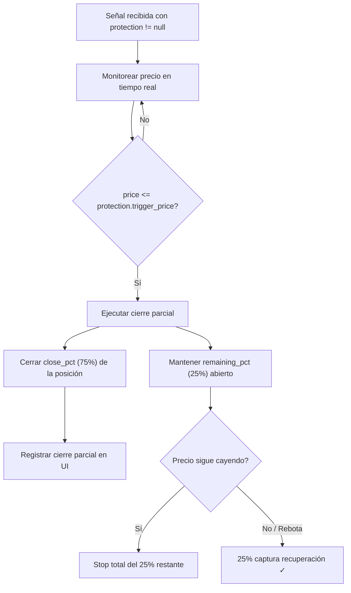

# Frontend Integration: Sistema de Protección Parcial

## Resumen

Se ha añadido un nuevo campo [protection](file:///c:/Users/Asus/Documents/GitHub/strategy/src/application/strategies/range_detection_strategy.py#544-580) a las señales de la estrategia [RangeDetection](file:///c:/Users/Asus/Documents/GitHub/strategy/src/application/strategies/range_detection_strategy.py#101-580). Este campo contiene las instrucciones para ejecutar un **cierre parcial** de la posición cuando el precio toca el piso del rango ([range_min](file:///c:/Users/Asus/Documents/GitHub/strategy/tests/test_range_detection_strategy.py#305-314)).

> [!IMPORTANT]
> El backend **NO** ejecuta el cierre parcial. El frontend/exchange handler es responsable de monitorear el precio y ejecutar el cierre cuando `price <= protection.trigger_price`.

---

## Nuevo campo [protection](file:///c:/Users/Asus/Documents/GitHub/strategy/src/application/strategies/range_detection_strategy.py#544-580) en la respuesta de señales

El campo [protection](file:///c:/Users/Asus/Documents/GitHub/strategy/src/application/strategies/range_detection_strategy.py#544-580) se encuentra junto a [hedge_short](file:///c:/Users/Asus/Documents/GitHub/strategy/src/application/strategies/range_detection_strategy.py#495-543) en todas las respuestas de señales:

```json
{
  "signals": [
    {
      "id": 123,
      "symbol": "BTC/USDT",
      "timeframe": "4h",
      "strategy_id": "RangeDetection",
      "signal_direction": "BUY",
      "entry": 60000.00,
      "tp1": 61500.00,
      "stop_loss": 58500.00,
      "market_scenario": "lateral",
      "hedge_short": {
        "entry_price": 60000.0,
        "stop_price": 61500.0,
        "target_price": 58500.0,
        "size_suggestion": "37.5% del valor total del pool",
        "rationale": "Short @ 60000.0000 | Stop...",
        "risk_pct": 2.5,
        "reward_pct": 2.5
      },
      "protection": {
        "trigger_price": 58500.0,
        "close_pct": 0.75,
        "remaining_pct": 0.25,
        "rationale": "Protección parcial: cerrar 75% al tocar 58500.0000 (piso del rango). Mantener 25% abierto por rebote. Ancho del rango: 5.13%."
      }
    }
  ]
}
```

### Esquema del campo [protection](file:///c:/Users/Asus/Documents/GitHub/strategy/src/application/strategies/range_detection_strategy.py#544-580)

| Campo | Tipo | Descripción |
|-------|------|-------------|
| `trigger_price` | `float` | Precio que activa la protección (= [stop_loss](file:///c:/Users/Asus/Documents/GitHub/strategy/tests/test_range_detection_strategy.py#305-314) = [range_min](file:///c:/Users/Asus/Documents/GitHub/strategy/tests/test_range_detection_strategy.py#305-314)) |
| [close_pct](file:///c:/Users/Asus/Documents/GitHub/strategy/tests/test_range_detection_strategy.py#421-430) | `float` | Fracción de la posición a cerrar (0.75 = 75%) |
| `remaining_pct` | `float` | Fracción que queda abierta (0.25 = 25%) |
| `rationale` | `string` | Explicación en texto natural del nivel de protección |

> [!NOTE]
> [protection](file:///c:/Users/Asus/Documents/GitHub/strategy/src/application/strategies/range_detection_strategy.py#544-580) es `null` para señales que NO son de la estrategia [RangeDetection](file:///c:/Users/Asus/Documents/GitHub/strategy/src/application/strategies/range_detection_strategy.py#101-580) o cuando no se detecta rango.

---

## Curl Examples

### 1. Generar señales con estrategia RangeDetection (+ protection)

```bash
curl -X POST "https://YOUR_API_URL/signals/generate" \
  -H "Authorization: Bearer YOUR_JWT_TOKEN" \
  -H "Content-Type: application/json" \
  -d '{
    "symbol": "BTC/USDT",
    "timeframe": "4h",
    "strategy_id": "range_detection",
    "initial_balance": 10000,
    "risk_per_trade": 1.0
  }'
```

### 2. Generar señales con protección parcial personalizada (e.g., 50%)

```bash
curl -X POST "https://YOUR_API_URL/strategies/set" \
  -H "Authorization: Bearer YOUR_JWT_TOKEN" \
  -H "Content-Type: application/json" \
  -d '{
    "strategy_name": "range_detection",
    "strategy_params": {
      "protection_close_pct": 0.50,
      "hedge_coverage_pct": 0.75
    }
  }'
```

### 3. Consultar señales existentes (incluyen protection)

```bash
curl -X GET "https://YOUR_API_URL/signals?strategy_id=RangeDetection&limit=10" \
  -H "Authorization: Bearer YOUR_JWT_TOKEN"
```

### 4. Forzar generación fresca (ignora cache)

```bash
curl -X POST "https://YOUR_API_URL/signals/generate?force_fresh=true" \
  -H "Authorization: Bearer YOUR_JWT_TOKEN" \
  -H "Content-Type: application/json" \
  -d '{
    "symbol": "ETH/USDT",
    "timeframe": "1d",
    "strategy_id": "range_detection"
  }'
```

### 5. Consultar señales por rango de fechas

```bash
curl -X POST "https://YOUR_API_URL/signals/generate" \
  -H "Authorization: Bearer YOUR_JWT_TOKEN" \
  -H "Content-Type: application/json" \
  -d '{
    "symbol": "BTC/USDT",
    "timeframe": "4h",
    "strategy_id": "range_detection",
    "start_date": "2026-03-01T00:00:00",
    "end_date": "2026-03-05T23:59:59"
  }'
```

---

## Parámetros configurables de la estrategia

| Parámetro | Default | Descripción |
|-----------|---------|-------------|
| [protection_close_pct](file:///c:/Users/Asus/Documents/GitHub/strategy/tests/test_range_detection_strategy.py#421-430) | `0.75` | % de la posición a cerrar al tocar piso (75%) |
| `hedge_coverage_pct` | `0.75` | Cobertura del hedge short (75% del valor volátil) |
| `adx_hard_threshold` | `20.0` | ADX < 20 → rango confirmado |
| `adx_soft_threshold` | `30.0` | ADX < 30 → rango posible |
| `lookback_bars` | `30` | Velas para calcular soporte/resistencia |
| `min_range_width_pct` | `0.15` | Ancho mínimo del rango (15%) |
| `safety_margin_atr` | `0.3` | Margen de seguridad = ATR × 0.3 |

---

## Lógica del Frontend para la Protección Parcial



### Pseudocódigo para el frontend

```javascript
// Cuando se recibe una señal con protection
function handleSignalProtection(signal) {
  if (!signal.protection) return;

  const { trigger_price, close_pct, remaining_pct } = signal.protection;

  // Registrar la orden de protección parcial
  createPartialStopOrder({
    symbol: signal.symbol,
    triggerPrice: trigger_price,
    closePercentage: close_pct * 100, // 75%
    side: 'SELL', // Cerrar posición long
    type: 'STOP_MARKET',
  });

  // Mostrar en UI
  displayProtectionInfo({
    triggerPrice: trigger_price,
    closePct: `${close_pct * 100}%`,
    remainingPct: `${remaining_pct * 100}%`,
    rationale: signal.protection.rationale,
  });
}
```

---

## Recomendaciones de Visualización

### 1. Card de Protección en la UI de señales

Cuando `protection != null`, mostrar un **badge** o **card** adicional en la señal:

```
┌─────────────────────────────────────────────┐
│  🛡️ PROTECCIÓN PARCIAL                      │
│                                             │  
│  Trigger:  $58,500.00 (piso del rango)      │
│  Cierre:   75% de la posición               │
│  Abierto:  25% por si hay rebote            │
│                                             │         
│  ▓▓▓▓▓▓▓▓▓▓▓▓▓▓▓░░░░░  75% cerrado         │
│                                             │
│  📖 "Protección parcial: cerrar 75%..."     │
└─────────────────────────────────────────────┘
```

### 2. Gráfico de Rango con zonas de protección

Visualizar en el chart de precios:

```
  $61,500 ┄┄┄┄┄┄ TP1 (techo del pool)  ──── 🟢 Verde
           │                            
  $60,000 ┄┄┄┄┄┄ ENTRY (precio actual)  ──── 🔵 Azul
           │                            
  $58,500 ┄┄┄┄┄┄ PROTECTION TRIGGER     ──── 🟠 Naranja (stop parcial 75%)
           │       ↓ Cerrar 75%
           │       ↓ Mantener 25%
  $57,000 ┄┄┄┄┄┄ STOP TOTAL            ──── 🔴 Rojo (cierre del 25% restante)
```

### 3. Componente de hedge + protección integrado

```
┌─────────────────────────────────────────────────┐
│  📊 POOL STRATEGY: BTC/USDT 4h                  │
│                                                 │
│  Rango: [$58,500 - $61,500]  (ancho: 5.13%)    │
│  Confianza: ◉◉◉◎◎ HIGH                         │
│                                                 │
│  ┌─── 🛡️ Protección ──────────────────────┐     │
│  │  Al tocar $58,500: cerrar 75%          │     │
│  │  Mantener 25% abierto por rebote       │     │
│  └────────────────────────────────────────┘     │
│                                                 │
│  ┌─── 📉 Hedge Short ────────────────────┐     │
│  │  Entry: $60,000 → Target: $58,500      │     │
│  │  Stop: $61,500 | Size: 37.5% del pool  │     │
│  │  Risk: 2.50% / Reward: 2.50%          │     │
│  └────────────────────────────────────────┘     │
│                                                 │
│  ⚠️ Esto NO es consejo de inversión.            │
└─────────────────────────────────────────────────┘
```

### 4. Indicadores de color para el estado de protección

| Estado | Color | Condición |
|--------|-------|-----------|
| 🟢 Activa | Verde | Precio dentro del rango, protección lista |
| 🟠 Ejecutándose | Naranja | Precio tocando trigger_price |
| 🔴 Ejecutada | Rojo | 75% cerrado, 25% aún abierto |
| ⚫ Completada | Gris | 100% cerrado (stop total) |

---

## Migración de Base de Datos

La migración `b4e9c3d2a1f0` agrega la columna [protection](file:///c:/Users/Asus/Documents/GitHub/strategy/src/application/strategies/range_detection_strategy.py#544-580) (JSON) a las tablas [signals](file:///c:/Users/Asus/Documents/GitHub/strategy/src/infrastructure/database/sqlalchemy_repository.py#417-447) y [backtest_signals](file:///c:/Users/Asus/Documents/GitHub/strategy/src/infrastructure/database/sqlalchemy_repository.py#235-245). Se ejecuta automáticamente con la auto-migración al arranque, o manualmente:

```bash
alembic upgrade head
```
