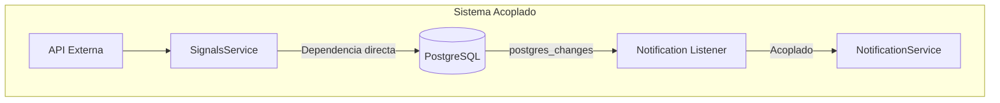
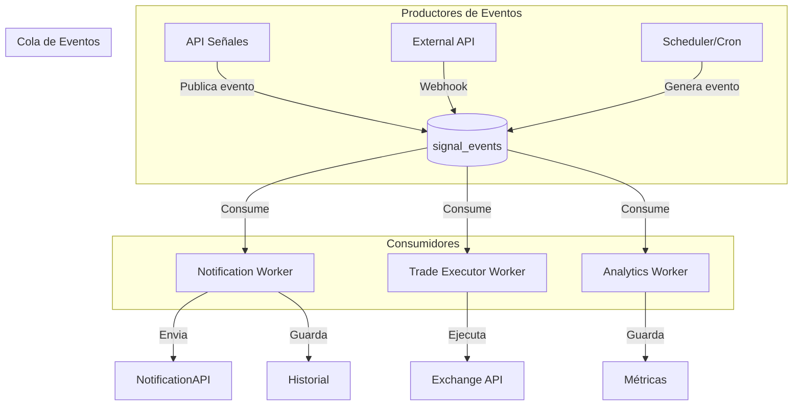

# Sistema de Notificaciones TradeIA - Arquitectura Basada en Eventos

## 1. Objetivo

Diseñar un sistema de notificaciones **agnóstico** que:
- No dependa de PostgreSQL ni de la API externa directamente
- Reciba señales por una cola de eventos pública
- Permita que múltiples consumidores procesen el mismo evento
- Un servicio notifica, otro servicio ejecuta trades

---

## 2. Análisis del Sistema Actual

### Problema Actual



El sistema actual tiene estos problemas:
1. **Acoplamiento fuerte**: NotificationService depende de la tabla `signals` en PostgreSQL
2. **Listener efímero**: El listener dura solo 30 segundos
3. **No hay separación de responsabilidades**: El servicio de notificaciones sabe demasiado sobre la fuente

---

## 3. Arquitectura Propuesta: Eventos con Cola

### 3.1 Flujo de Eventos



### 3.2 Diseño de Eventos

El evento publicado en la cola debe ser **autocontenido** y **agnóstico**:

```typescript
// El evento NO debe depender de PostgreSQL ni de ninguna fuente específica
interface SignalEvent {
  eventId: string;           // ID único del evento
  eventType: 'signal_generated' | 'signal_updated' | 'signal_cancelled';
  timestamp: string;         // ISO timestamp
  source: string;           // Quién generó el evento: 'api', 'webhook', 'scheduler'
  correlationId?: string;   // Para trazabilidad
  payload: SignalPayload;    // Datos de la señal
}

interface SignalPayload {
  signalId: string;
  symbol: string;            // BTC/USDT
  direction: 'LONG' | 'SHORT';
  entry: number;
  stopLoss: number;
  takeProfit1?: number;
  takeProfit2?: number;
  timeframe: string;         // 1h, 4h, 1d
  strategyId: string;
  strategyName: string;
  riskLevel: 'low' | 'medium' | 'high';
  metadata?: Record<string, any>;
}
```

### 3.3 Esquema de Colas

```typescript
// Colas del sistema
enum QueueNames {
  SIGNAL_EVENTS = 'signal_events',      // Eventos de señales
  NOTIFICATIONS = 'notifications',       // Cola de notificaciones
  TRADE_EXECUTION = 'trade_execution',  // Ejecución de trades
  NOTIFICATION_RETRY = 'notification_retry' // Reintentos
}
```

---

## 4. Implementación del NotificationService Agnóstico

### 4.1 Nuevo Servicio

El servicio de notificaciones será **agnóstico**:

```typescript
// src/lib/services/EventNotificationService.ts

export class EventNotificationService {
  // No depende de PostgreSQL ni de la API externa
  // Solo procesa eventos de la cola
  
  async processSignalEvent(event: SignalEvent): Promise<void> {
    // 1. Extraer datos del evento
    const payload = event.payload;
    
    // 2. Obtener usuarios a notificar por estrategia/símbolo
    const usersToNotify = await this.getUsersByPreferences(
      payload.strategyId,
      payload.symbol
    );
    
    // 3. Enviar notificaciones
    for (const user of usersToNotify) {
      await this.sendNotification(user, payload);
    }
  }
  
  private async getUsersByPreferences(strategyId: string, symbol: string) {
    // Lee preferencias de usuario (única dependencia externa)
    // Pero NO depende de la tabla signals
  }
}
```

### 4.2 Worker de Notificaciones

```typescript
// src/lib/workers/notification-worker.ts
import { QueueManager, QueueWorker } from '@/lib/queue/message-queue';

interface SignalEventMessage {
  id: string;
  type: 'signal_generated' | 'signal_updated';
  payload: SignalPayload;
  timestamp: number;
}

export class NotificationWorker implements QueueWorker {
  constructor(private notificationService: EventNotificationService) {}
  
  async process(message: QueueMessage): Promise<void> {
    const event: SignalEventMessage = message.payload;
    
    switch (event.type) {
      case 'signal_generated':
        await this.notificationService.processSignalEvent(event);
        break;
      case 'signal_updated':
        await this.notificationService.processSignalUpdate(event);
        break;
    }
  }
}
```

---

## 5. Productores de Eventos

### 5.1 API de Señales (Productor)

```typescript
// Cuando se genera una señal, en lugar de guardarla directamente,
// publicamos un evento en la cola

// src/app/api/signals/generate/route.ts
import { QueueManager } from '@/lib/queue/message-queue';

async function generateSignal(req: NextRequest) {
  // 1. Generar señal (llamada a API externa o mock)
  const signal = await generateSignalData(req.body);
  
  // 2. Publicar evento en la cola (NO guardar directamente en DB)
  const queueManager = new QueueManager();
  await queueManager.enqueue('signal_events', 'signal_generated', {
    eventId: `evt_${Date.now()}`,
    eventType: 'signal_generated',
    timestamp: new Date().toISOString(),
    source: 'api',
    payload: signal
  });
  
  // 3. Responder inmediatamente
  return NextResponse.json({ signal, eventId: eventId });
}
```

### 5.2 Trade Executor (Otro Consumidor)

```typescript
// Este worker lee la misma cola pero para ejecutar trades
// No necesita saber cómo se generó la señal, solo la procesa

// src/lib/workers/trade-executor-worker.ts
export class TradeExecutorWorker implements QueueWorker {
  async process(message: QueueMessage): Promise<void> {
    const event: SignalEventMessage = message.payload;
    
    // Verificar si el usuario tiene auto-trade habilitado
    const userConfig = await this.getUserAutoTradeConfig(event.payload.strategyId);
    
    if (userConfig?.autoExecute) {
      await this.executeTrade(event.payload);
    }
  }
}
```

---

## 6. Plan de Implementación

### Fase 1: Refactorizar NotificationService

| Tarea | Descripción | Archivo |
|-------|-------------|---------|
| 1.1 | Crear `EventNotificationService` agnóstico | `src/lib/services/EventNotificationService.ts` |
| 1.2 | Definir interfaces de eventos | `src/lib/events/types.ts` |
| 1.3 | Actualizar preferences para soportar filtro por estrategia/símbolo | `/services/NotificationService.ts` |

###src/lib Fase 2: Implementar Productores

| Tarea | Descripción | Archivo |
|-------|-------------|---------|
| 2.1 | Modificar `/api/signals/generate` para publicar eventos | `src/app/api/signals/generate/route.ts` |
| 2.2 | Crear endpoint para webhooks externos | `src/app/api/webhooks/signals/route.ts` |
| 2.3 | Crear scheduler para generación periódica | `src/lib/jobs/signal-generator.ts` |

### Fase 3: Implementar Consumidores

| Tarea | Descripción | Archivo |
|-------|-------------|---------|
| 3.1 | Crear `NotificationWorker` | `src/lib/workers/notification-worker.ts` |
| 3.2 | Crear `TradeExecutorWorker` | `src/lib/workers/trade-executor-worker.ts` |
| 3.3 | Registrar workers en QueueManager | `src/lib/workers/index.ts` |

### Fase 4: Webhooks y Métricas

| Tarea | Descripción | Archivo |
|-------|-------------|---------|
| 4.1 | Endpoint de webhooks de NotificationAPI | `src/app/api/notifications/webhook/route.ts` |
| 4.2 | Sistema de reintentos con cola | `src/lib/queue/retry-queue.ts` |
| 4.3 | Métricas de notificaciones | `src/app/api/notifications/stats/route.ts` |

---

## 7. Beneficios de esta Arquitectura

| Beneficio | Descripción |
|-----------|-------------|
| **Desacoplamiento** | El servicio de notificaciones no sabe cómo se generó la señal |
| **Escalabilidad** | Múltiples workers pueden procesar la misma cola |
| **Resiliencia** | Si un worker falla, el mensaje vuelve a la cola |
| **Trazabilidad** | Cada evento tiene correlationId para seguimiento |
| **Extensibilidad** | Fácil agregar nuevos consumidores (analytics, backtest) |

---

## 8. Preguntas de Confirmación

Antes de proceder con la implementación, necesito confirmar:

1. **Cola**: ¿Quieren usar Redis (ya configurado) o prefiren seguir con Supabase Realtime?

2. **Productor**: ¿El flujo principal será la API `/signals/generate` o vendrán webhooks externos?

3. **Trade Executor**: ¿Ya tienen un servicio de ejecución de trades o hay que crearlo también?

4. **Prioridad**: ¿Quieren que先 implemente el worker de notificaciones o el de ejecución de trades?
