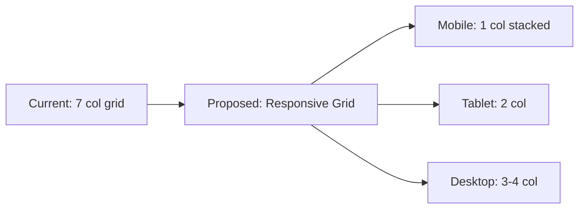

# Frontend Improvement Plan: Signals & Backtest Mobile Views

## Overview
This plan addresses mobile responsiveness issues in the Signals and Backtest pages, plus adds copy functionality for generated signals.

---

## Current Issues Identified

### Signals Page (`apps/tradeia/src/app/dashboard/signals/page.tsx`)
1. **Filter Form (lines 501-627)**: Uses `grid-cols-1 md:grid-cols-2 lg:grid-cols-7` - shows 7 fields in a row on large screens which is too cramped, and doesn't stack properly on mobile
2. **Signals Table (lines 736-831)**: Has 17 columns - impossible to view on mobile without excessive horizontal scrolling
3. **No Copy Functionality**: Users cannot easily copy generated signals

### Backtest Page (`apps/tradeia/src/app/dashboard/backtest/page.tsx`)
1. **Form Layout (lines 684-985)**: Uses `grid-cols-1 xl:grid-cols-3` - works but could be improved
2. **Trades Table (lines 1156-1465)**: Has 14 columns - still problematic on mobile
3. **No Copy Functionality**: Cannot copy trade details

---

## Proposed Solutions

### 1. Signals Page Improvements

#### A. Filter Form Redesign


**Changes:**
- Break single large grid into logical sections
- Use `grid-cols-1 sm:grid-cols-2 lg:grid-cols-3 xl:grid-cols-4` for better responsive behavior
- Group related fields (dates together, risk params together, etc.)
- Add collapsible/expandable sections on mobile

#### B. Signals Table → Card Layout (Mobile)
```
Desktop: Table view with all 17 columns
Tablet: Table with horizontal scroll
Mobile: Card-based vertical layout
```

**Changes:**
- On mobile (`<640px`): Convert each row to a card
- Show key fields: Symbol, Type, Direction, Entry, TP, SL, R/R
- Hide less critical fields or show in "expand" section
- Add "Copy" button visible on all screen sizes

#### C. Copy Signal Functionality
**Format:**
```
SYMBOL: BTC/USDT
TYPE: BUY
DIRECTION: LONG
ENTRY: 45000.00
TP1: 46000.00
TP2: 47000.00
SL: 44000.00
TIMEFRAME: 4h
STRATEGY: Moderate Strategy
```

**Implementation:**
- Add copy button (clipboard icon) to each signal row
- On click: Copy formatted text to clipboard
- Show toast/feedback: "Signal copied!"
- Also add "Copy All" button for selected signals

---

### 2. Backtest Page Improvements

#### A. Form Layout Enhancement
- Use similar responsive grid as signals
- Improve date picker layout on mobile
- Better strategy selector for touch devices

#### B. Trades Table → Card Layout (Mobile)
- Similar approach to signals table
- Show key trade info in card format
- Add copy trade button

#### C. Copy Trade Functionality
**Format:**
```
SYMBOL: BTC/USDT
DIRECTION: BUY
ENTRY: 45000.00
EXIT: 45500.00
SL: 44000.00
TP: 46000.00
P/L: +1.11%
BALANCE: 10111.11
```

---

## Implementation Order

1. **Phase 1: Signals Page - Filter Form** (Priority: High)
   - Redesign responsive grid layout
   - Improve mobile stacking

2. **Phase 2: Signals Page - Table to Cards** (Priority: High)
   - Create responsive card layout for mobile
   - Maintain table for desktop

3. **Phase 3: Signals Page - Copy Functionality** (Priority: High)
   - Add copy button component
   - Implement copy-to-clipboard logic
   - Add user feedback (toast)

4. **Phase 4: Backtest Page - Form Improvements** (Priority: Medium)
   - Apply similar responsive patterns

5. **Phase 5: Backtest Page - Trades Cards + Copy** (Priority: Medium)
   - Mobile card layout
   - Copy functionality

---

## Technical Notes

### Responsive Breakpoints Used
- `sm`: 640px
- `md`: 768px  
- `lg`: 1024px
- `xl`: 1280px

### Key Tailwind Classes to Use
- `hidden md:block` - show only on larger screens
- `md:hidden` - hide on larger screens, show on mobile
- `grid grid-cols-1 sm:grid-cols-2 lg:grid-cols-3` - responsive grid

### Copy to Clipboard API
```javascript
navigator.clipboard.writeText(text).then(() => {
  // Show success feedback
});
```

---

## Files to Modify
1. `apps/tradeia/src/app/dashboard/signals/page.tsx` - Main signals page
2. `apps/tradeia/src/app/dashboard/backtest/page.tsx` - Main backtest page

---

## Success Criteria
- [ ] Forms are fully usable on 320px width screens
- [ ] Tables convert to cards on mobile (<640px)
- [ ] Copy button works and shows feedback
- [ ] No horizontal scroll on mobile for main content
- [ ] Desktop layout remains unchanged/enhanced
